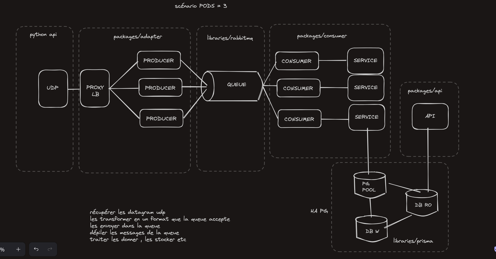

#### Start the project locally

Overview:


(locally because there's a problem with the url of the backend prisma database that prevents the migration from being launched when the docker image is built)

start containers

```sh
docker compose up
```

create database migration and sync

```sh
make init-prima
```

install dependencies

```sh
npm install
```

build TS

```sh
npm run build
```

start UDP server that is also the MQ producer

```sh
npm run start:udp
```

start the MQ consumer

```sh
npm run start:consumer
```

start the TCP server

```sh
npm run start:api
```

Then, in your repo, start your python UDP script

```sh
python3 clients.py localhost 41234 3000
```
